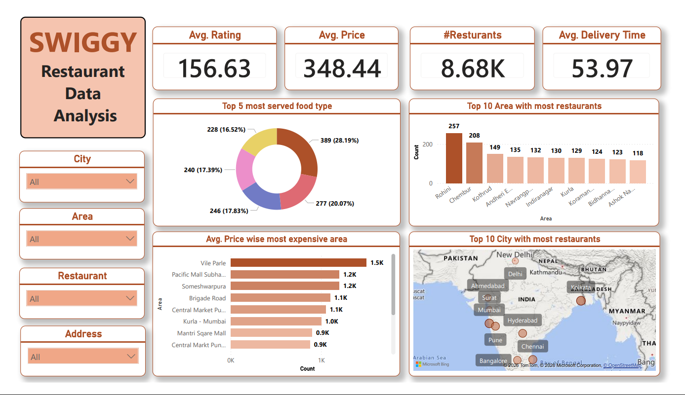
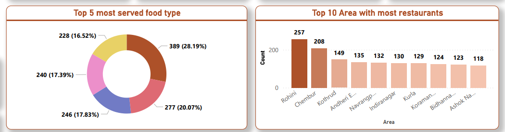
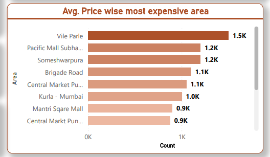
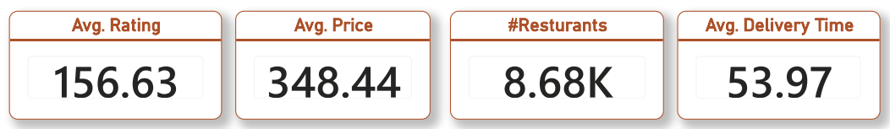

# Swiggy Restaurant Analytics Dashboard

A Power BI project analysing restaurant performance data across multiple Indian cities using real-world Swiggy data, focused on understanding what separates high-performing restaurants from the rest.

---

## Project Overview

This dashboard was built to answer a question that matters to anyone in the food-tech or restaurant industry:

> *Across thousands of restaurants on Swiggy, what patterns actually predict performance — and where are the biggest gaps in delivery, pricing, and cuisine?*

The analysis covers 8,680+ restaurants across major Indian cities, surfacing patterns in delivery time, pricing, ratings, and cuisine distribution that aren't visible from looking at individual listings.

---

## Business Objective

Restaurant aggregator platforms generate enormous amounts of performance data. This project translates that data into decisions:

- Which cities and areas have the highest restaurant density — and is that market saturated?
- Are premium-priced areas actually delivering better ratings, or just charging more?
- Which cuisine types are underserved relative to demand?
- Where are delivery times slowest, and what does that mean for customer experience?

---

## Key Performance Indicators

| Metric | Value |
|--------|-------|
| Total Restaurants Analysed | 8,680+ |
| Average Delivery Time | 53.97 minutes |
| Average Price per Order | ₹348.44 |
| Cities Covered | Multiple major Indian metros |

---

## Key Insights

**1. Average delivery time of 54 minutes is well above customer expectations.**
Industry benchmarks for food delivery satisfaction sit around 30-35 minutes. At 53.97 minutes average, most restaurants on this dataset are operating above the threshold where customer ratings typically start to drop. This suggests a systemic logistics problem, not just individual restaurant performance.

**2. Premium areas charge significantly more but don't always rate higher.**
The price analysis reveals that the most expensive areas command much higher average order values — yet ratings don't scale proportionally. Customers in premium locations are paying more but not necessarily reporting better experiences, which is a quality gap worth investigating.

**3. Restaurant concentration is heavily clustered in a few areas.**
The top 10 areas contain a disproportionate number of listings. This means competition in those zones is intense, while other areas are relatively underserved. For a business, the underserved areas represent expansion opportunities with less competition.

**4. A handful of cuisine types dominate the platform.**
The top 5 most-served food types account for the majority of restaurant listings. This creates a long tail of less-represented cuisines that may face less competition and could serve unmet demand in certain localities.

**5. City-level delivery time variance is significant.**
Delivery times are not uniform across cities — some metros show considerably slower averages than others. This points to infrastructure and partner density differences that Swiggy could address with targeted logistics investment.

---

## Dashboard Preview

### Dashboard Overview

### Restaurant Analysis

### Price Analysis

### KPI Summary

---

## Dashboard Features

- **4 interactive filter slicers** — drill into any city, area, restaurant, or address instantly
- **Top 5 cuisine distribution** — see which food types dominate each market
- **Top 10 area concentration map** — visualise where restaurants cluster geographically
- **Price vs. rating comparison** — understand whether expensive areas deliver value
- **City-level delivery benchmarking** — compare delivery performance across metros
- **KPI cards** — avg rating, avg price, total restaurants, avg delivery time at a glance

---

## Tools Used

| Tool | Purpose |
|------|---------|
| Power BI | Dashboard development and visualisation |
| Power Query | Data cleaning and transformation |
| DAX | Custom calculated measures |
| Microsoft Excel | Initial data inspection |

---

## Dataset

The dataset contains real-world restaurant listings from Swiggy including:
- Restaurant Name, City, Area, Address
- Cuisine Type
- Average Rating
- Average Price per Order
- Estimated Delivery Time

---

## Business Recommendations

1. **Delivery time is the biggest lever.** Reducing average delivery from 54 to 40 minutes would likely move ratings more than any other single change.
2. **Target underserved areas for expansion.** Areas outside the top 10 concentration zones have real demand with less competition.
3. **Investigate the premium pricing gap.** If expensive areas aren't getting better ratings, it's either a service quality problem or a customer expectation mismatch — both are fixable.
4. **Promote underrepresented cuisines.** Lower competition in niche cuisine categories could attract restaurant partners who struggle for visibility in saturated segments.

---

## Project Workflow

1. Data ingestion and inspection in Excel
2. Data cleaning and transformation in Power Query
3. DAX measures for KPIs (avg delivery, avg price, rating aggregations)
4. Dashboard design with interactive slicer panel
5. Geographic and segment-level analysis
6. Insight generation and business recommendations

---

## Author

**Harshit Kaishwar**
📧 kaishwarsid@gmail.com
🔗 [LinkedIn](https://www.linkedin.com/in/harshit-kaishwar-7286112b9)
🐙 [GitHub](https://github.com/Harshit-Kai)
